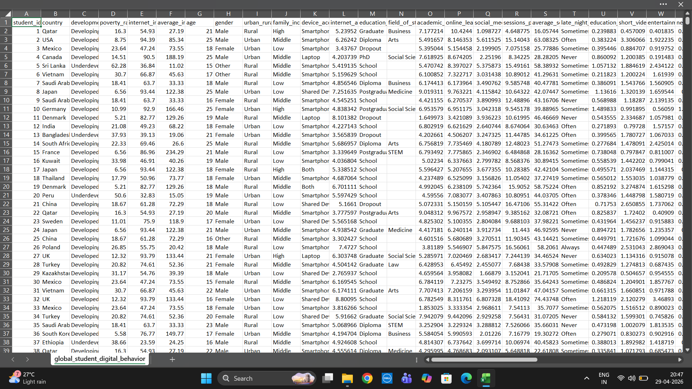
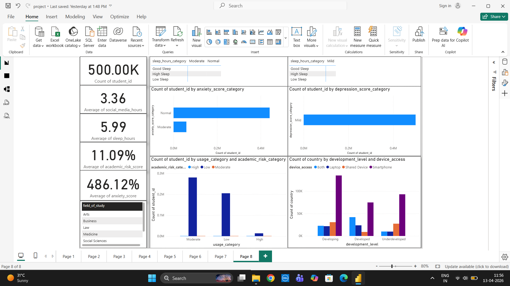
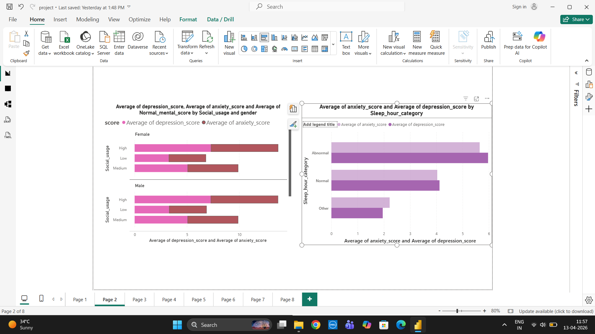
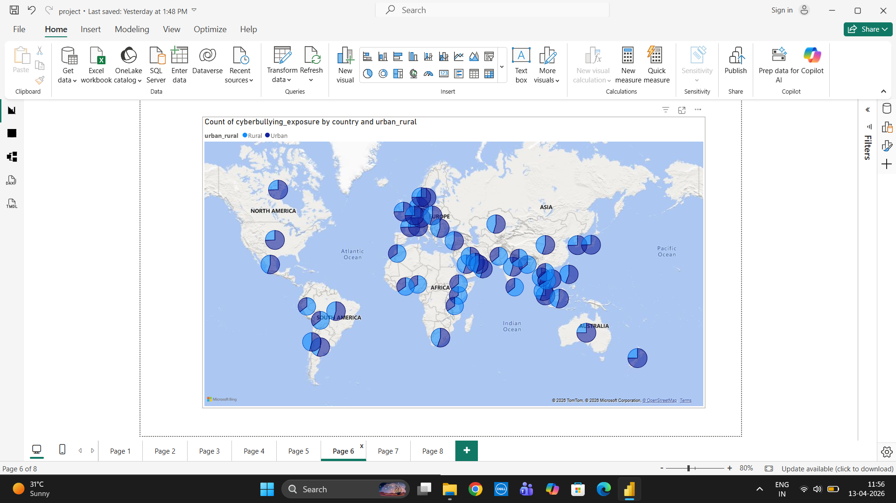
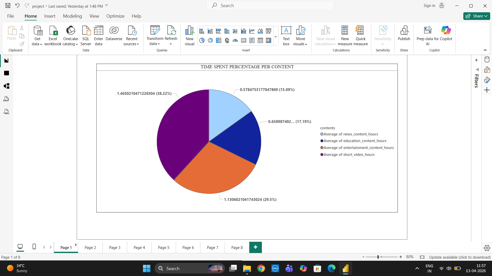

# Student Social Media Impact Analysis

## Overview
This project analyzes the impact of social media usage on student behavior, mental health, and productivity using real-world data.

## Tools & Technologies
- SQL – Data cleaning and querying  
- Python (Pandas, NumPy, Seaborn) – Data preprocessing and analysis and few visualizations
- Power BI – Data visualization and dashboard creation  

## Dataset
- Contains 50,000+ records of student behavior  
- Features include:
  - Social media usage  
  - Mental health indicators  
  - Sleep patterns  
  - Productivity scores  

Note: Due to GitHub file size limitations, the full dataset is not uploaded. A sample dataset is included.

## Project Workflow
1. Data cleaning using SQL  
2. Data preprocessing using Python  
3. Exploratory Data Analysis (EDA)  
4. Dashboard creation in Power BI  

## Key Insights
- Higher screen time is associated with lower productivity  
- Increased social media usage impacts mental health negatively  
- Balanced usage shows better student engagement
  
## Dashboard Preview
### Raw Data

### Overview Dashboard

### Mental Health Analysis

### Cyberbullying Exposure

### Engagement Analysis

## Power BI Dashboard
The complete dashboard is available as a PDF file in this repository:
- `glo_stu_dashboard.pdf`

##  Files Included
- Python scripts (`.py`)  
- SQL queries (`.sql`)  
- Dashboard PDF  
- Sample dataset (`.xlsx`)  
- Dashboard images (`.png`) 

## How to Use
1. Download the sample dataset  
2. Run SQL scripts for data cleaning  
3. Use Python scripts for analysis  
4. View dashboard PDF for insights  

## Conclusion
This project demonstrates end-to-end data analysis skills, from data cleaning to visualization, providing insights into student behavior influenced by social media.
